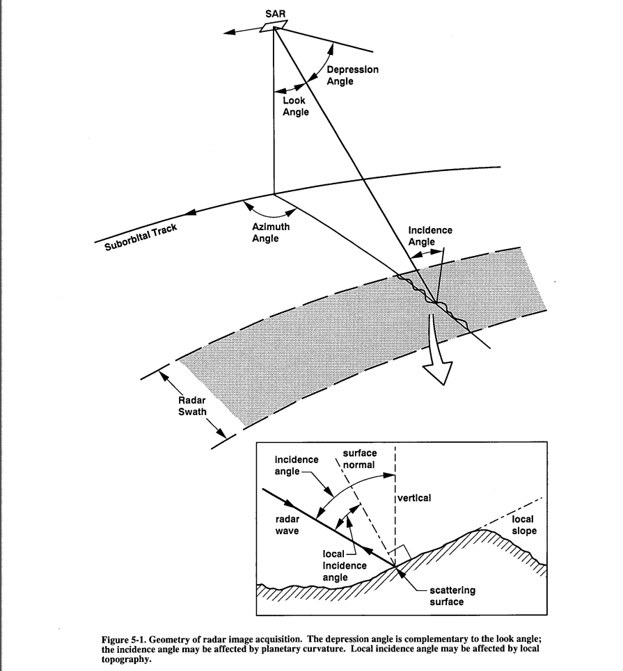

## Lotta Research

### Adressing [The Hidden Face of Venus](https://github.com/amnh/HackTheSolarSystem/wiki/The-Hidden-Face-of-Venus)

### Created By Team Team

- Jennifer Shin <https://github.com/jennshin>
- Adam Ibrahim <https://github.com/beelzebielsk>

Status Report:

We can read in the binary data from a single orbit from the Magellan
Mission and view it as greyscale images.

We're currently researching leads on what to do next. There are
existing tools for generating DEMs, but would not be directly
compatible with the Magellan data. There's also existing work on the
Magellan data we could improve on. Finally, there are tools to create
DEMs used for later planetary missions; perhaps we could make use of
those by making them compatible with magellan data.

### Solution Description

The current solution is *research*. Reading. Lots of it.

The file `images.py` is a demo of the F-BIDR file reading work, and
can extract a grayscale image from Magellan Mission data, if some is
placed in the repostiory root directory.

# Progress

This will describe our current understanding of the project. What we
know so far. Future work is covering what we know we don't know, and
looking for tools that could help us.

## Key Sources

- Data from the Magellan mission is available
  [here](http://pds-geosciences.wustl.edu/mgn/mgn-v-rdrs-5-bidr-full-res-v1/)
- The Magellan Software Interface Specification (SIS) for the F-BIDR
  files located in `papers+documents/MGN-FBIDR-SIS-SDPS-101-RevE.pdf`.
  Each F-BIDR is a collection of 20 files (and some extra metadata
  files, whose extension is `.lbl`) which contain both image data and
  metadata about the image and spacecraft. This document describes the
  binary format of some of the files in detail (Files 12-19), and also
  describes the meaning of the information, but is not sufficient
  alone for interpretation. From here on in, will be called just *FBIDR SIS*.
- The Guide to Magellan Image Interpretation located in
  `papers+documents/19940013181.pdf`. This is broader in scope and
  less terse than the F-BIDR SIS. It goes over details of the mission,
  contains a lot of definitions for important terms and concepts in
  the way that satellites function, and the way that the radar on the
  satellite functions as well. For actual image interpretation,
  Chapters 2 and 5 of this document are valuable.
  From here on, will be called just *Magellan Guide*.

## Problems: what are we trying to overcome?

The Magellan data was collected between about 1991 and 1993. The
mission happened before later tools for sterogrammetry (getting
elevation data from a pair of images from different perspectives of
the same region) were developed. So the data isn't immediately usable
with known tools for performing stereogrammetry.

Magellan carried an altimeter on board, but the resolution of the
height data is very large (on the order of 10km in between each
sample), and is not always reliable. In mountainous regions, errors in
altitude can be as large as a kilometer.

Lastly, the actual images are not optical images; they are not created
by reflected visible light from a surface. This was done for different
reasons, but one of them being thick clouds that cover Venus.
Radiation that could penetrate the clouds had to be used.

So for an accurate map of elevation for Venus, techniques that rely on
images of the surface have to be used, because that's what's
available, could produce results more accurate and at higher
resolutions than the on-board altimeter.

## What do the pictures mean, and where are they in the data?

There's supposed to be image data of Venus' surface. Where?

Each F-BIDR is a collection of 20 files, much of which is metadata.
Files 12-19, as specified in the FBIDR SIS are comprised of pieces
called *logical records*. Files 13 and 15 have logical records which
contain both satellite metadata and image data from the radar. The
satellite metadata helps us understand which part of Venus' surface
the image corresponds to, so that the pieces can be joined together
into larger pictures which represent a whole orbit, or multiple
orbits.

Each pixel represents $75m^2$ of Venus' surface. They're 75m wide and
tall. A radar on Magellan emitted radiation from a small dish and
captured some of the radiation back a small amount of time later. The
intensity of the pixel is the intensity of the reflected radiation.
What precisely this means we can't quite say. It's easier to start off
with what it *isn't*.

- It's not brightness of the surface. The radiation isn't visible and
  the radar wasn't affected by visible light (we assume).
- It has nothing to do with color of the surface (we assume).

What the intensities tell us is how capable a given patch of land was
at reflecting the radiation back toward the satellite. Chapter 5 of
the Magellan Guide goes into more detail about this, but here's a
summary. First, an image describing various terms on satellite
orientation toward the surface. 

There's a few things that affect how capable a patch of land is at
reflecting radiation: the *incidence angle* (the angle between the
radiation and the surface struck by it), the roughness of the ground,
and the patch having very reflective materials. If a patch has more
reflective materials, then generally the intensity of the pixel
representing that patch will be greater. For the other two parameters,
the explanation is less straightforward; incidence angle and roughness
have an interplay, as shown in the following 2 figures:

In the very top image, the surface is flat so it acts like a mirror.
Radiation hits it and then bounces away. If the incidence angle is
small, then the radiation will probably bounce back toward the radar
causing very bright intensity (radar-bright); if the incidence angle
is large, then the flat ground will show up dark (radar-dark).

The more rough the ground, the less intensity will shoot right back at
the radar in any one direction because the radiation will be spread
out in different directions; however regardless of the incidence
angle, light is more likely to go back to the radar than miss it. The
following graph shows this in more detail. Higher radar backscatter
means higher pixel intensity.

Notice that the graph for rough ground changes less with incidence
angle while the graph for flat ground changes a lot with incidence
angle.

Now that we've seen the interplay of incidence angle and roughness,
it is important to revisit the first photo explaining the radar's
orientation to the ground it imaged. In the radar swath is a flat line
with a squiggly line around it; the flat line is a *reference
surface*. An assumed flat surface of the planet. The squiggly
represents the actual surface. Now, look at the little
picture-in-picture section of the figure. It shows you that the actual
incidence angle depends on the surface being imaged. So the
reflectiveness of the surface depends on more than just roughness, but
also its slope.

Here's two radar images of some mountains in California which display
the difference between different incidence angles. They're of the same
region; the dark bottom of the top image is not the night sky (we
thought it was for a moment), but *flat ground* from a high incidence
angle ($50\deg$). There are bright dots in the dark region of the top
photo; look for them in the bottom photo to be able to compare the two
regions. The pictures are basically the same scale and width and
height.

Left to Explain:

- Maybe the behavior of the satllite? How it spun around the planet,
  how it recorded radar data. A diagram of the orbit inclincation
  angle could help, and the rotation direction of Venus. I drew one of
  those already.
- Cycles, what was gained from each cycle.
- How we piece together pieces of an image.
- Binary format of the data? Eh... 
- The format of the files, at least. And their role. I could at least
  point them to a good page in the FBIDR SIS.
- Explanation of image metadata, important pieces. Explanation of the
  different coordinate systems (sinusoidal pixel/line and spherical
  lat/lon).
- What sources of image data are available and what do they provide?
  Why work with the original? This is a bit of a pitfall for a newbie,
  because there's lots of stuff that looks like it should be fine and
  makes the project a cinch, but there's some sort of trouble with it.
  Inaccurate, or produced poorly or something like that.
- Maybe include a list of sources, like a report.
